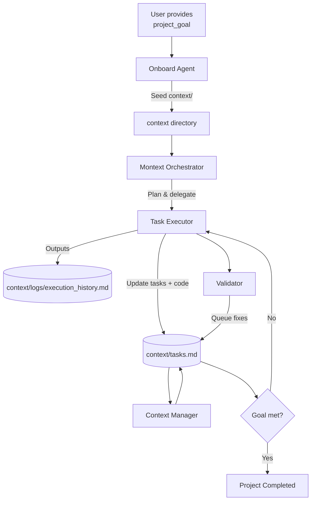

# Montext Autonomous Context System

A self-steering development workspace that uses GitHub Copilot Agents (onboard, orchestrator, executor, context manager, validator) plus Model Context Protocol (MCP) tools to move a single high-level goal all the way to completion. Once the goal is set, the agents collaborate through the `context/` directory to share intent, tasks, and historical notes.

---

## TL;DR
- **Give Montext one clear project goal** and open the repo inside VS Code Insiders with Copilot Agents + MCP enabled.
- **Onboard Agent** seeds `context/` with a refined goal, inbounds/outbounds, prioritized tasks, and a first log entry.
- **Orchestrator Agent** coordinates planning and delegates tasks to **Task Executor**.
- **Context Manager** protects `context/` integrity; **Validator** samples work and queues fixes.
- Repeat the loop until all tasks in `context/tasks.md` are complete and the optimized goal is satisfied.

---

## Why It Exists
| Problem | Montext Solution |
| --- | --- |
| Long onboarding time for existing repos | Automated onboarding agent that builds the context files for you. |
| Agents lose track of project goals | `context/optimized_project_goal.md` keeps the refined target front-and-center. |
| Scope creep | `context/inbounds.md` + `context/outerbounds.md` act as living guardrails. |
| Chaotic task lists | `context/tasks.md` is the single queue shared by every agent. |
| Missing traceability | `context/logs/execution_history.md` records every major decision. |

---

## Quick Start
1. **Open in VS Code Insiders** with Copilot Agents preview + MCP support.
2. **Start the `montext-orchestrator` Copilot agent** and provide a `project_goal` (e.g., "Add telemetry to the core engine").
3. **Let the onboarding flow finish**. It will generate/refresh all files under `context/`.
4. **Track work in `context/tasks.md`**. Each task includes an owner, status, and the next step.
5. **Let the Task Executor run**. It reads tasks, edits the repo, updates the task list, and logs results.
6. **Validate**. Periodically trigger the validator agent (or allow scheduled runs) to audit the work and append corrective tasks.

> 💡 Human edits should be rare. If you do change `context/` manually, keep the same structure and atomic update rules.

---

## Directory Map
| Path | Purpose |
| --- | --- |
| `context/optimized_project_goal.md` | Refined, MCP-aware statement of the goal for all agents. |
| `context/inbounds.md` | 20 scope items describing what *must* be covered. |
| `context/outerbounds.md` | 20 exclusions to avoid scope creep. |
| `context/tasks.md` | The prioritized queue. Each task is appended or updated atomically. |
| `context/logs/execution_history.md` | Chronological log of onboarding + autonomous execution decisions. |
| `src/contextService.ts` | Runtime stub that shows how atomic context reads/writes work. |
| `src/boundariesService.ts` | Generates inbounds/outbounds/tasks from repo analysis. |
| `src/coreEngine.ts` | Demonstrates the autonomous task loop. |
| `src/montextOrchestrator.ts` | Wire-up entry point for supplying `project_goal`. |
| `.github/agents/*.md` | Behavior contracts for each Copilot agent persona. |
| `.github/prompts/*.md` | Prompts that power Plan/Execute/Validate modes. |

---

## Workflow Narrative
1. **Kickoff** – Provide a `project_goal`. Onboard Agent ensures `context/` exists and writes the optimized goal, boundaries, tasks, and log entries.
2. **Plan** – Orchestrator Agent reviews the new context, optionally runs Plan Mode, and may update the goal or tasks before delegating work.
3. **Execute** – Task Executor chooses the top task, performs edits across the repo, and updates `context/tasks.md` + logs atomically.
4. **Manage Context** – Context Manager checks that every change to `context/` is consistent, versioned, and reversible.
5. **Validate** – Validator replays finished work, samples diffs, and adds remediation tasks when needed.
6. **Complete** – When `context/tasks.md` has no pending items and the optimized goal is satisfied (per `inbounds.md`), the project is done.

---

## System Diagram (Mermaid)

---

## Tips for Effective Use
- **Keep instructions centralized**: If you need to update boundaries or goals, edit the corresponding `context/*.md` file so every agent sees the change immediately.
- **Leverage MCP**: Connect any MCP servers in `.github/mcp.json` so agents can securely run code, inspect telemetry, or call internal tools.
- **Log liberally**: Record non-obvious decisions in `context/logs/execution_history.md` for future agents.
- **Review tasks before editing**: Always look at `context/tasks.md` to avoid duplicating work.
- **Use validator feedback**: Treat validator-added tasks as high-priority bug fixes.

---

## Need a Runtime?
The repo ships with TypeScript stubs under `src/` that you can flesh out to run Montext without Copilot Agents:
1. Implement the TODOs in `contextService`, `boundariesService`, and `coreEngine`.
2. Use `montextOrchestrator.ts` to accept CLI input and call `run(project_goal)`.
3. Hook in MCP-compatible tool adapters if you want to mirror the Copilot agent behavior programmatically.

Once the runtime or agents finish the queue, archive `context/` along with `context/logs/execution_history.md` to preserve the provenance of the completed project.
